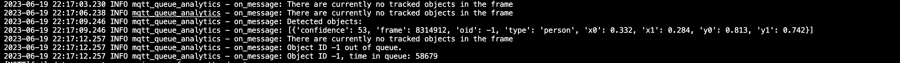

# Meraki MV Sense Store Foot Fall Analytics
This PoV leverages Cisco Meraki MQTT REST APIs to fetch data from Meraki MV Cameras. This data is interpreted to analyse customer foot-fall and customer-employee interactions in stores. These interactions include time in queue for customers, consultation period between customers and employees, idle time for employees on desks and backrooms of the store. 

The purpose is to showcase capabilities of MV Sense object detection algorithms to get insights about individuals while protecting their privacy. 

## Contacts
* Lakshya Tyagi

## Solution Components
* Cisco Meraki MV Cameras
* Cisco MV Sense MQTT REST APIs

## Pre-Requisites

### Meraki API Key
In order to use the Meraki API, you need to enable the API for your organization first. After enabling API access, you can generate an API key. Follow these instructions to enable API access and generate an API key:

Login to the Meraki dashboard
In the left-hand menu, navigate to Organization > Settings > Dashboard API access
Click on Enable access to the Cisco Meraki Dashboard API
Go to My Profile > API access
Under API access, click on Generate API key

Save the API key in a safe place. The API key will only be shown once for security purposes, so it is very important to take note of the key then. 

### Meraki MV Camera Zones
This POV requires specific zones to filter parts of a camera's full frame and differentiate between employees and customers based on the zones within which they are present. To create zones with Meraki MV Cameras:

Login to the Meraki dashboard.
Navigate to your camera > Settings > Zones
Click on New Zone to create a new zone and provide a relevant label.

For more information on how to create and use zones, please [click here](https://developer.cisco.com/meraki/mv-sense/#!zones)

### Meraki MV Sense MQTT Server
MQTT is a Client-Server publish/subscribe messaging transport protocol. It is lightweight, open, simple, and designed to be easy to implement. These characteristics make it ideal for use in constrained environments, such as for communication in machine-to-machine (M2M) and the internet of things (IoT) contexts where a small code footprint is required or network bandwidth is at a premium. 

This PoV requires a MQTT server to communicate with the MV camera to fetch relevant data. Please [click here](https://developer.cisco.com/meraki/mv-sense/#!mqtt/what-is-mqtt) for information on how to use and set-up the MQTT REST APIs for Meraki MV Sense. 


## Installation/Configuration Flask API

1. Clone/download this repository and navigate to src/

2. Create a python virtual environment
```python
python3 -m venv <venv_name>
```

4. Activate python virtual environment and download dependencies.
```python
source <venv_name>/bin/activate

# Execute the following to download dependencies.
pip install -r requirements.txt
```

5. Navigate to the .env file and add the following environment variables:
```python
# api.py ENV variables
HOST = "0.0.0.0"
PORT = "5999"

# Meraki Credentials
MERAKI_BASE_URL = "https://api.meraki.com/api/v1"
MERAKI_API_KEY = ""
MERAKI_ORG_ID = ""
MERAKI_NETWORK_ID = ""
MERAKI_DEVICE_SERIAL = ""

ZONE_ID_FULL_FRAME = ""
ZONE_ID_BACKROOM = ""
ZONE_ID_EMPLOYEE_DESK = ""
ZONE_ID_CONSULTATION_CUSTOMER = ""
ZONE_ID_CONSULTATION_EMPLOYEE = ""

# MQTT Server Credentials
MQTT_PORT = "1883"
MQTT_SERVER = "test.mosquitto.org"
``` 


## Usage

1. Execute the scripts
```python
# For Consultation time analytics
python mqtt_consultation_time.py

# For Queue analytics
python mqtt_queue_analytics.py

# For REST API GET requests, persons in backroom, persons on employee desks
python back_office_count.py
```

2. All detection queue exits or consultations will be printed as logs as they are triggered:



### LICENSE

Provided under Cisco Sample Code License, for details see [LICENSE](LICENSE.md)

### CODE_OF_CONDUCT

Our code of conduct is available [here](CODE_OF_CONDUCT.md)

### CONTRIBUTING

See our contributing guidelines [here](CONTRIBUTING.md)

#### DISCLAIMER:
<b>Please note:</b> This script is meant for demo purposes only. All tools/ scripts in this repo are released for use "AS IS" without any warranties of any kind, including, but not limited to their installation, use, or performance. Any use of these scripts and tools is at your own risk. There is no guarantee that they have been through thorough testing in a comparable environment and we are not responsible for any damage or data loss incurred with their use.
You are responsible for reviewing and testing any scripts you run thoroughly before use in any non-testing environment.
